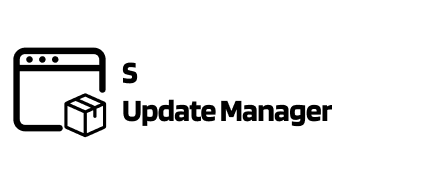

# s-update-manager

<a href="https://github.com/SebastianWesolowski/starter-npm-package"></a>

## Important Links

- [![npm package][npm-img]][npm-url]
- [![Build Status][build-img]][build-url]
- [Author page](https://wesolowski.dev)

<br>
<br>

- [why](docs/why.md)
- [Instalations](docs/instalations.md)
  - [How to use](docs/howToUse.md)
  - [default list repo](docs/default-list-repo.md)
  - [create your own repo](docs/create-your-own-repo.md)
  - [template structure](docs/template-structure.md)
  - [CLI parameters](docs/cli-parameters.md)
  - [config File](docs/config-file.md)
  - [Adjust configuration](docs/adjust-configuration.md)
- [How to use](docs/howToUse.md)
- [Known Problems](docs/knowProblems.md)

- [Development process](docs/development.md)

---

<br/>

## Whai is s-update-manager

s-update-manager is designed to maintain project configurations based on an external repository.

Continue reading [Why](docs/why.md)

## Install

use your favorite package manager to install update-manager.

```bash
yarn add s-update-manager
```

### Choose template repository

before use you have to chose repository with templates.

You have 2 way

- default repos [default-list-repo](default-list-repo.md)
- create your own repo [create-your-own-repo](create-your-own-repo.md)

In this example we will use [node template](https://github.com/SebastianWesolowski/s-template/tree/main/templates/node)

### Setup scripts

In package.json add script to your project

```json
"scripts": {
  "update": "s-update --remoteRepository='https://github.com/SebastianWesolowski/s-template/tree/main/templates/node'",
  "build": "s-build --remoteRepository='https://github.com/SebastianWesolowski/s-template/tree/main/templates/node'",
  "init": "s-init --remoteRepository='https://github.com/SebastianWesolowski/s-template/tree/main/templates/node'"
}
```

Ypu can add aditional cli parameters to script.

[CLI parameters](docs/cli-parameters.md)

### Run script

depends on your needs

- `init` - initialize project with template
- `build` - build project after [adjust configuration](adjust-configuration.md) files
- `update` - update project if new version of template is avaliable

## Example project

You can see example project in `example/realProject/`

## Badges

[![Downloads][downloads-img]][downloads-url]
[![Issues][issues-img]][issues-url]
[![Commitizen Friendly][commitizen-img]][commitizen-url]
[![Semantic Release][semantic-release-img]][semantic-release-url]

[build-img]: https://github.com/SebastianWesolowski/s-update-manager/actions/workflows/release.yml/badge.svg
[build-url]: https://github.com/SebastianWesolowski/s-update-manager/actions/workflows/release.yml
[downloads-img]: https://img.shields.io/npm/dt/s-update-manager
[downloads-url]: https://www.npmtrends.com/s-update-manager
[npm-img]: https://img.shields.io/npm/v/s-update-manager
[npm-url]: https://www.npmjs.com/package/s-update-manager
[issues-img]: https://img.shields.io/github/issues/SebastianWesolowski/s-update-manager
[issues-url]: https://github.com/SebastianWesolowski/s-update-manager/issues
[semantic-release-img]: https://img.shields.io/badge/%20%20%F0%9F%93%A6%F0%9F%9A%80-semantic--release-e10079.svg
[semantic-release-url]: https://github.com/semantic-release/semantic-release
[commitizen-img]: https://img.shields.io/badge/commitizen-friendly-brightgreen.svg
[commitizen-url]: http://commitizen.github.io/cz-cli/
